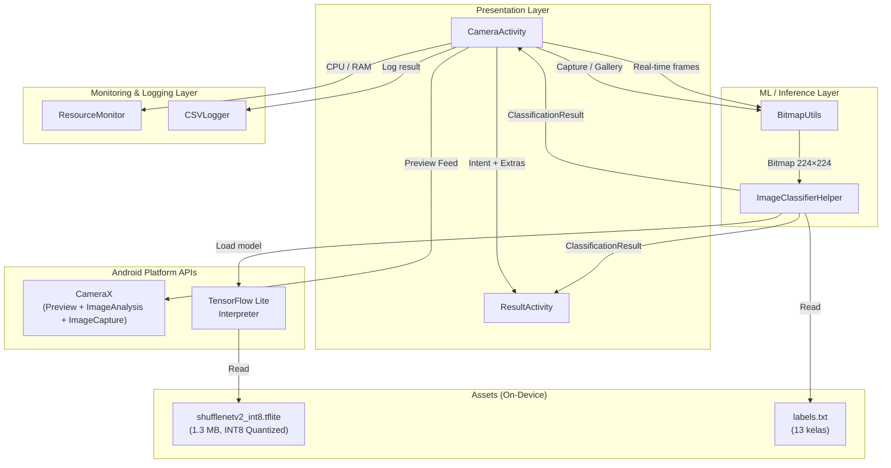
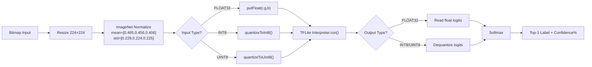
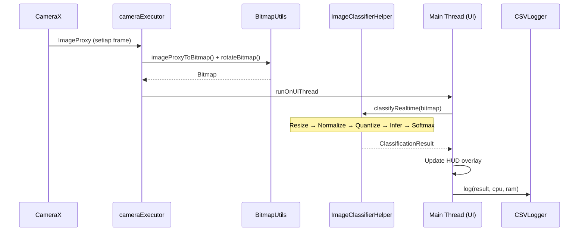
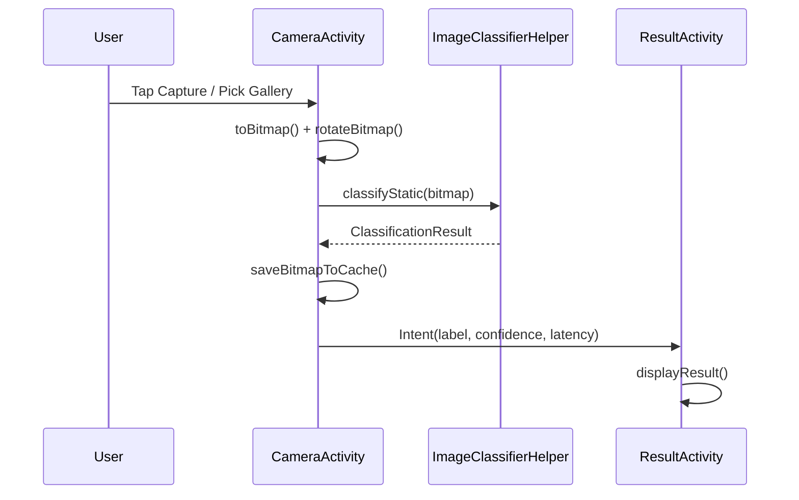
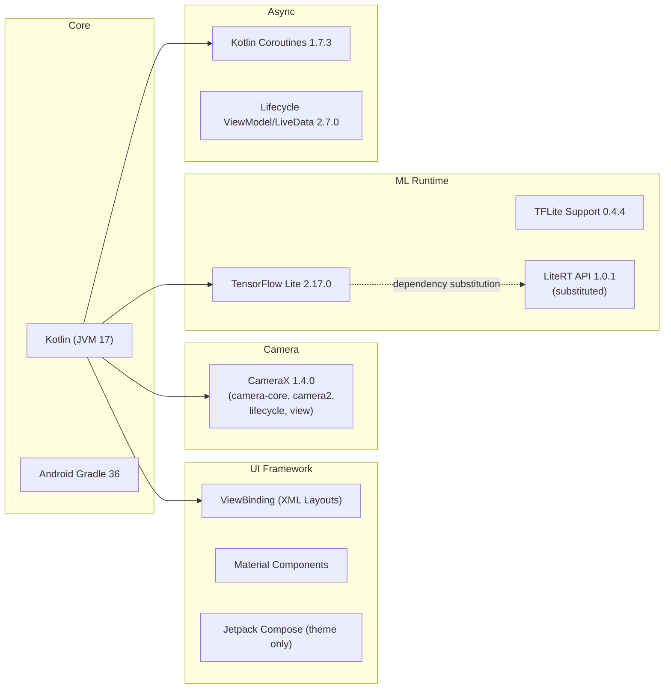

# 🏛️ Rangkuman Arsitektur Sistem — LeafDiseaseDetector

> Aplikasi Android **Edge AI** untuk deteksi penyakit daun tanaman (Kentang & Tomat) menggunakan model **ShuffleNetV2 1.0x** yang berjalan 100% offline di perangkat.

---

## 1. Informasi Umum Proyek

| Item | Detail |
|---|---|
| **Nama Aplikasi** | LeafDiseaseDetector |
| **Package** | `com.randy25.leafdiseasedetector` |
| **Bahasa** | Kotlin |
| **Min SDK** | 24 (Android 7.0) |
| **Target SDK** | 36 (Android 15) |
| **Build System** | Gradle KTS + Version Catalog (`libs.versions.toml`) |
| **Pola Arsitektur** | Activity-based (View Layer) + Helper Classes |

---

## 2. Diagram Arsitektur Tingkat Tinggi



---

## 3. Struktur Direktori Proyek

```
AndroidAPPProject/
├── app/
│   └── src/main/
│       ├── AndroidManifest.xml
│       ├── assets/
│       │   ├── shufflenetv2_int8.tflite      ← Model TFLite (INT8)
│       │   └── labels.txt                     ← 13 kelas penyakit
│       ├── java/com/randy25/leafdiseasedetector/
│       │   ├── CameraActivity.kt              ← Layar utama + kamera
│       │   ├── ResultActivity.kt              ← Layar hasil klasifikasi
│       │   ├── ImageClassifierHelper.kt       ← Inference engine
│       │   ├── BitmapUtils.kt                 ← Konversi & preprocessing gambar
│       │   ├── CSVLogger.kt                   ← Logging hasil ke CSV
│       │   ├── ResourceMonitor.kt             ← Monitor CPU & RAM
│       │   └── ui/theme/                      ← Jetpack Compose theme (unused)
│       └── res/
│           ├── layout/
│           │   ├── activity_camera.xml         ← Layout kamera real-time
│           │   └── activity_result.xml         ← Layout hasil detail
│           └── values/, drawable/, mipmap-*/
└── build.gradle.kts, settings.gradle.kts
```

---

## 4. Komponen Utama & Tanggung Jawab

### 4.1 Presentation Layer (Activities)

#### [CameraActivity.kt](file:///d:/Documents/Semester%208/Tugas%20Akhir/AndroidAPPProject/app/src/main/java/com/randy25/leafdiseasedetector/CameraActivity.kt) — **Launcher / Layar Utama**

| Fitur | Implementasi |
|---|---|
| **Camera Preview** | CameraX `PreviewView` dengan `DEFAULT_BACK_CAMERA` |
| **Real-time Inference** | `ImageAnalysis` (backpressure: `KEEP_ONLY_LATEST`) → setiap frame diklasifikasi |
| **Capture** | `ImageCapture` → klasifikasi static → simpan ke cache → buka `ResultActivity` |
| **Gallery Picker** | `PickVisualMedia` API → decode bitmap → klasifikasi → buka `ResultActivity` |
| **HUD Overlay** | Menampilkan: Prediction Label, Confidence %, Latency ms |
| **Threading** | `cameraExecutor` (single-thread) untuk capture/analysis, `lifecycleScope` + `runOnUiThread` untuk UI |

#### [ResultActivity.kt](file:///d:/Documents/Semester%208/Tugas%20Akhir/AndroidAPPProject/app/src/main/java/com/randy25/leafdiseasedetector/ResultActivity.kt) — **Layar Hasil Detail**

| Fitur | Implementasi |
|---|---|
| **Tampilan Gambar** | Membaca `captured_image.jpg` dari cache |
| **Hasil Klasifikasi** | Menerima via `Intent Extras` (label, confidence, latency) |
| **Fallback** | Jika extras kosong → inisialisasi ulang `ImageClassifierHelper` → klasifikasi dari cache |
| **Info Ditampilkan** | Label penyakit, Confidence %, Latency ms, Capture timestamp |

---

### 4.2 ML / Inference Layer

#### [ImageClassifierHelper.kt](file:///d:/Documents/Semester%208/Tugas%20Akhir/AndroidAPPProject/app/src/main/java/com/randy25/leafdiseasedetector/ImageClassifierHelper.kt) — **Inference Engine**

Komponen inti yang membungkus seluruh pipeline TFLite:



| Detail | Nilai |
|---|---|
| **Model** | `shufflenetv2_int8.tflite` (1.3 MB, INT8 Post-Training Quantization) |
| **Input** | `[1, 224, 224, 3]` — RGB normalized (ImageNet stats) |
| **Output** | `[1, 13]` — 13 kelas (logits → softmax → probabilitas) |
| **Threads** | 4 CPU threads |
| **Quantization** | Adaptif: membaca `dataType()` dan `quantizationParams()` saat init |
| **Suspend** | `classifyRealtime()` dan `classifyStatic()` berjalan di `Dispatchers.Default` |

#### [BitmapUtils.kt](file:///d:/Documents/Semester%208/Tugas%20Akhir/AndroidAPPProject/app/src/main/java/com/randy25/leafdiseasedetector/BitmapUtils.kt) — **Utilitas Gambar**

| Fungsi | Deskripsi |
|---|---|
| `imageProxyToBitmap()` | Konversi `ImageProxy` (YUV_420_888 / JPEG) → `Bitmap` via CameraX built-in |
| `resizeBitmap()` | Resize ke ukuran target (224×224) |
| `rotateBitmap()` | Rotasi sesuai orientasi sensor kamera |

---

### 4.3 Monitoring & Logging Layer

#### [ResourceMonitor.kt](file:///d:/Documents/Semester%208/Tugas%20Akhir/AndroidAPPProject/app/src/main/java/com/randy25/leafdiseasedetector/ResourceMonitor.kt)

| Metrik | Cara Pengukuran |
|---|---|
| **RAM (PSS)** | `Debug.getMemoryInfo()` → `totalPss / 1024` → MB |
| **CPU %** | Delta `Process.getElapsedCpuTime()` / Delta `SystemClock.elapsedRealtime()` × 100 |

#### [CSVLogger.kt](file:///d:/Documents/Semester%208/Tugas%20Akhir/AndroidAPPProject/app/src/main/java/com/randy25/leafdiseasedetector/CSVLogger.kt)

- **Lokasi**: `Documents/leaf_detection_logs.csv` (external files dir)
- **Kolom**: `Timestamp, Label, Confidence, Latency_ms, CPU_Usage, RAM_Usage_MB`
- Setiap frame real-time yang berhasil diklasifikasi → 1 baris CSV

---

## 5. Alur Data (Data Flow)

### 5.1 Mode Real-time (Kamera)



### 5.2 Mode Snapshot (Capture / Gallery)



---

## 6. Kelas Penyakit yang Dideteksi (13 Kelas)

| # | Label | Tanaman |
|---|---|---|
| 0 | Potato___Early_blight | 🥔 Kentang |
| 1 | Potato___Late_blight | 🥔 Kentang |
| 2 | Potato___healthy | 🥔 Kentang |
| 3 | Tomato__Target_Spot | 🍅 Tomat |
| 4 | Tomato__YellowLeaf_Curl_Virus | 🍅 Tomat |
| 5 | Tomato__Tomato_mosaic_virus | 🍅 Tomat |
| 6 | Tomato_Bacterial_spot | 🍅 Tomat |
| 7 | Tomato_Early_blight | 🍅 Tomat |
| 8 | Tomato_Late_blight | 🍅 Tomat |
| 9 | Tomato_Leaf_Mold | 🍅 Tomat |
| 10 | Tomato_Septoria_leaf_spot | 🍅 Tomat |
| 11 | Tomato_Spider_mites | 🍅 Tomat |
| 12 | Tomato_healthy | 🍅 Tomat |

---

## 7. Technology Stack & Dependencies



> [!NOTE]
> Terdapat **dependency substitution** di `build.gradle.kts`: `tensorflow-lite-api` di-redirect ke `com.google.ai.edge.litert:litert-api:1.0.1` untuk kompatibilitas.

---

## 8. Status Pengembangan (Progress)

| Tahap | Status | Keterangan |
|---|---|---|
| ✅ Setup Gradle & Project | **Done** | Dependencies lengkap |
| ✅ Model & Label Assets | **Done** | `shufflenetv2_int8.tflite` + `labels.txt` |
| ✅ AndroidManifest | **Done** | Permissions, 2 Activities terdaftar |
| 🔄 Utility & Helpers | **In Progress** | `BitmapUtils`, `ImageClassifierHelper`, `CSVLogger`, `ResourceMonitor` sudah ada |
| ⬜ CameraActivity | **Perlu Validasi** | Kode ada, perlu testing di device |
| ⬜ ResultActivity | **Perlu Validasi** | Kode ada, perlu testing di device |
| ⬜ Resource Monitoring | **Perlu Validasi** | CSV logging sudah terimplementasi |

---

## 9. Catatan Arsitektural

> [!IMPORTANT]
> **Bug yang Sudah Diperbaiki** (didokumentasikan langsung di kode):
> 1. **BUG KRITIS 1**: `bitmap` selalu `null` di `processImageAnalysis()` karena `finally { imageProxy.close() }` dalam Kotlin membuang return value blok `try`. Solusi: pisahkan close dari try-catch.
> 2. **BUG KRITIS 2**: `lifecycleScope.launch{}` dipanggil dari background thread → crash. Solusi: gunakan `runOnUiThread {}` sebelum launch.
> 3. **BUG MINOR**: Capture/Gallery tidak menjalankan klasifikasi sebelum membuka `ResultActivity`. Solusi: tambahkan klasifikasi dan kirim hasil via Intent extras.

> [!TIP]
> **Peluang Improvement**:
> - Migrasi dari Activity-based ke **MVVM** penuh dengan `ViewModel` + `StateFlow`
> - Compose theme sudah ada tapi belum digunakan — bisa migrasi UI ke full Compose
> - `CSVLogger` menulis file secara sinkron di setiap frame → pertimbangkan batching atau coroutine channel
> - `classifyStatic()` saat ini hanya memanggil `classifyRealtime()` — bisa dioptimasi khusus untuk gambar resolusi tinggi
